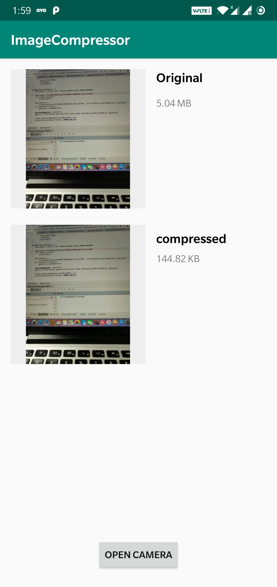

## Description
  The small sample application that compress the Image file without any noise. It can compress 5MB image to nearby 140 KB.
  
##ScreenShot
    
  
##Usage
    
   **For Single File**

```kotlin
CompressApplication.getInstanse()!!.getFileCompress()
            .compress(this, selectedImageFile!!)
            .compose(RxJavaUtils.applyObserverSchedulers<File>())
            .subscribe({ file ->
                Log.i("CompressedImageFile",file!!.absolutePath)
            }, { throwable -> throwable.printStackTrace() })
```  
   **For List of Images**
   
   ```kotlin
CompressApplication.getInstanse()!!.getFileCompress()
            .compress(this, fileList)
            .compose(RxJavaUtils.applyObserverSchedulers<List<File>>())
            .subscribe({ filelist ->
                Log.i("CompressedImageFile",filelist!!.size)
            }, { throwable -> throwable.printStackTrace() })
```

##License

```
Copyright 2019 Ramkumar-27

Licensed under the Apache License, Version 2.0 (the "License");
you may not use this file except in compliance with the License.
You may obtain a copy of the License at

    http://www.apache.org/licenses/LICENSE-2.0

Unless required by applicable law or agreed to in writing, software
distributed under the License is distributed on an "AS IS" BASIS,
WITHOUT WARRANTIES OR CONDITIONS OF ANY KIND, either express or implied.
See the License for the specific language governing permissions and
limitations under the License.
```